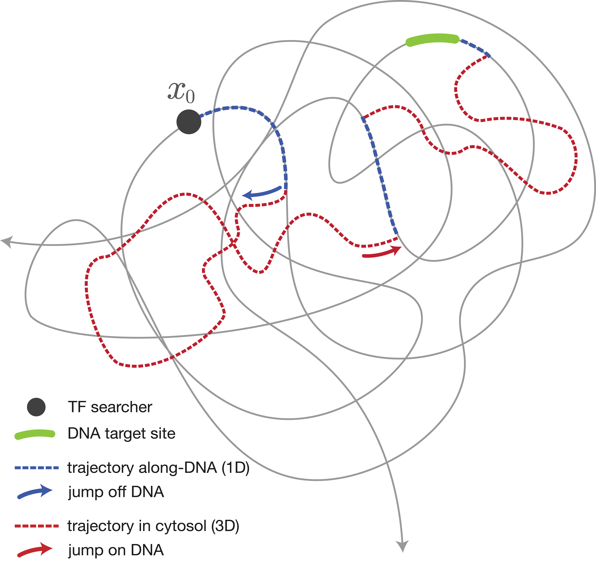
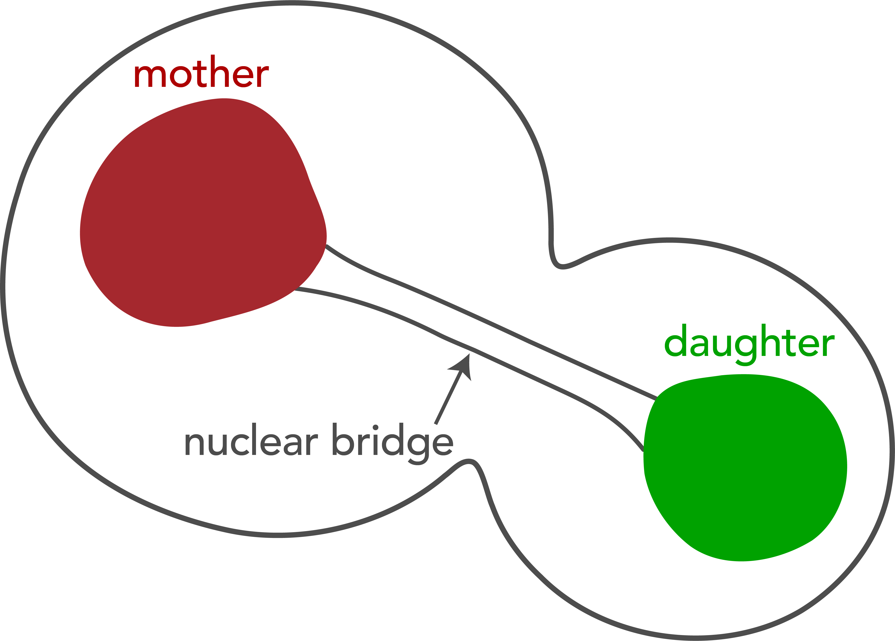
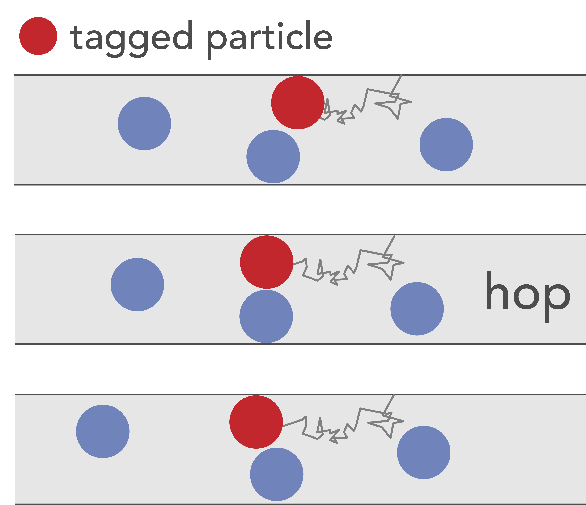
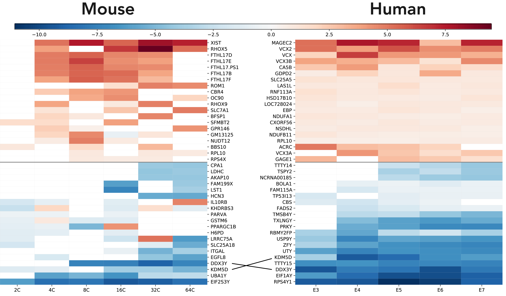

My research uses mathematical and computational modeling to investigate problems motivated by biology. I’m particularly interested in stochastic systems, where randomness plays an essential role in observed behavior.

## Stochastic Models of Biological Search

::: {.research-figure-right}
{width=100%}
:::

Many cellular processes depend on how quickly diffusing molecules can locate small targets. My PhD research examined how stochastic switching between different modes of motion affects these search times, motivated by facilitated diffusion of transcription factors searching for specific binding sites on DNA.

To model this process, we developed an intermittent-search model in which particles stochastically switch between an active state that allows them to detect the target while diffusing and a hidden state in which they continue to diffuse but cannot detect it. In the facilitated-diffusion interpretation, these states represent motion along DNA and excursions away from the DNA, respectively. We used first-passage theory and asymptotic analysis to study the fastest search among many independent particles. When particles begin hidden, a very fast search requires both favorable initial positioning and sufficiently rapid activation into the search state. Requiring both events to occur on short timescales changes the extreme first-passage behavior and gives rise to distinct asymptotic regimes depending on the switching dynamics. We derived asymptotic approximations for the fastest search time in these different regimes and used numerical methods to characterize the transitions between them.  
*[(Manuscript in preparation)](../publications/index.qmd#facilitated-diffusion)*

## Diffusion in Complex Geometries
Geometry can fundamentally alter the behavior of diffusing particles, particularly when motion is restricted by narrow passages or strong confinement. In two projects, we studied how geometric constraints affect escape times and collective diffusive behavior.

### Narrow escape through a tube 
The classical narrow escape problem asks how long it takes a diffusing particle to escape a bounded domain through a small opening. Motivated in part by asymmetric cell division in budding yeast, where a narrow nuclear bridge restricts diffusion between mother and daughter compartments, we studied a variation in which particles escape through a long, narrow tube.

::: {.research-figure-right style="margin: -2rem 1rem 1rem 1rem;"}
{width=100%}
:::

Using matched asymptotic analysis and probabilistic methods, we derived asymptotic approximations for the mean escape time, resolving conflicting estimates that had appeared in the literature. We also investigated the case in which diffusivity differs between the tube and surrounding domain, providing a way to distinguish the effects of geometry from hindered diffusion within the narrow passage.  
*[(View publication)](../publications/index.qmd#narrow-escape)*

### Quasi-single-file diffusion
When particles diffuse through sufficiently narrow channels, they cannot pass one another, producing single-file diffusion. We studied quasi-single-file diffusion, where slightly wider confinement permits rare passing events, leading to a crossover from single-file behavior at short times to ordinary Fickian diffusion at long times. 

::: {.research-figure-left style="width: 32%; margin: -1rem 2rem 1rem 0;"}
{width=100%}
:::

By combining boundary homogenization with kinetic Monte Carlo simulations, we quantified how the mean time between passing events, known as the hopping time, depends on confinement geometry. This hopping time determines the timescale of the crossover between the two diffusive regimes, with applications to transport in tightly confined environments such as membrane channels.  
*[(View publication)](../publications/index.qmd#quasi-single-file)*

## Evolutionary and Developmental Genomics {style="clear: both;"}

::: {.research-figure-right style="width: 50%; margin:  1rem 0rem 0rem 2rem;"}
{width=100%}
:::

Before my PhD, I worked in bioinformatics and comparative genomics, using computational methods to study gene expression and molecular evolution across sexes and species. In one project, we analyzed single-cell RNA-sequencing data from human and mouse preimplantation embryos to investigate sex-biased gene expression early in development. We found widespread transcriptional differences between the sexes, with similar functional patterns across species despite differences in the specific genes involved.  
*[(View publication)](../publications/index.qmd#comparative-developmental-genomics)*

I also studied the rapid evolution of male reproductive proteins in great apes, combining estimates of positive selection with protein-interaction networks to investigate whether adaptive genes evolve independently or together within functional networks.
